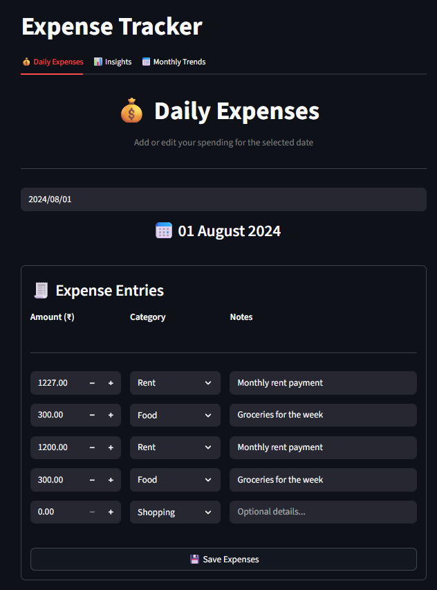
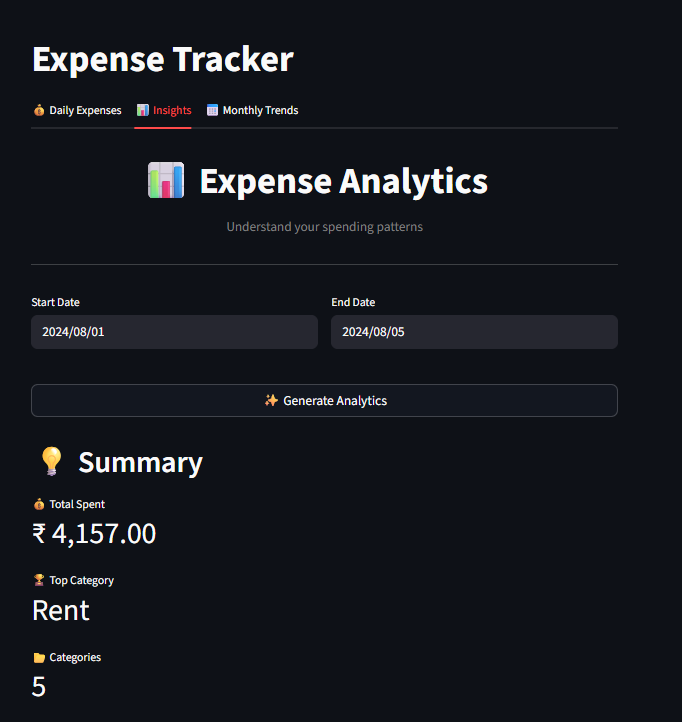
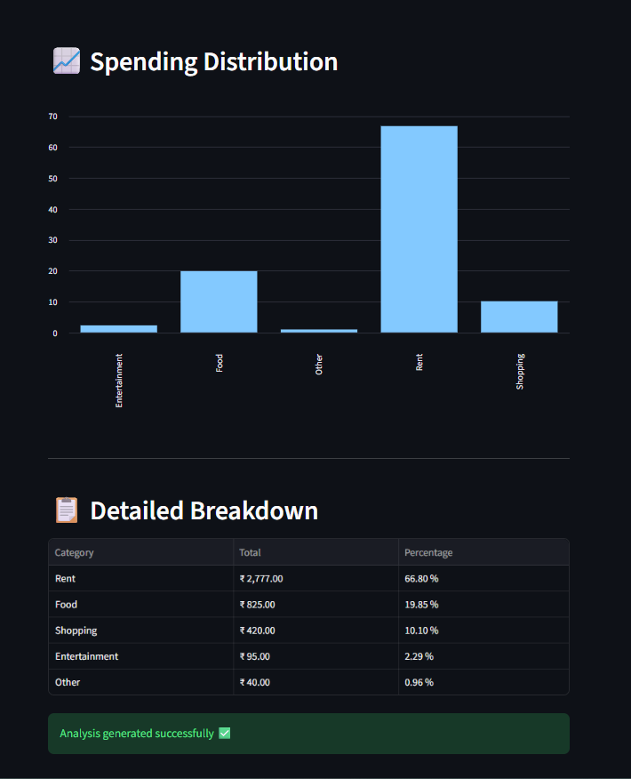
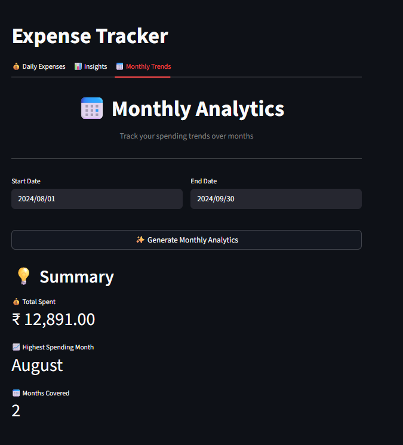
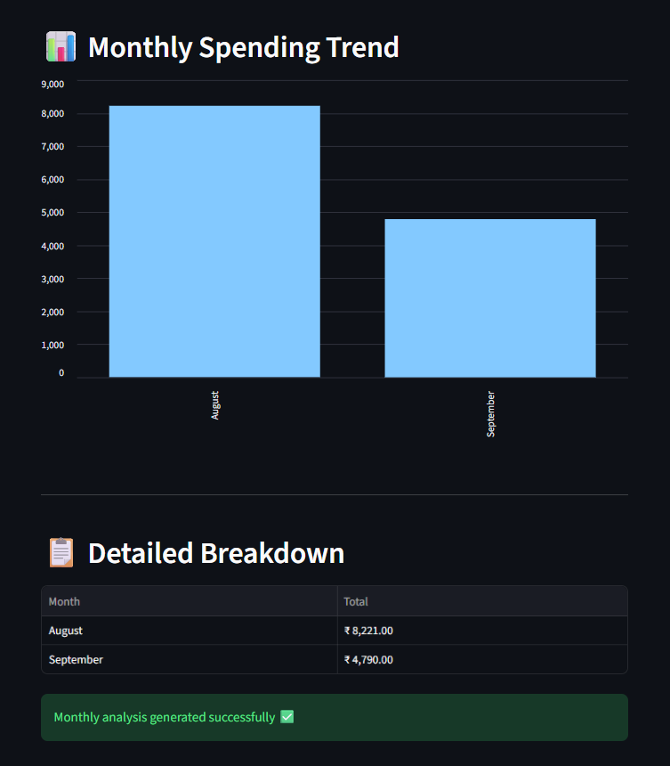

# 💰 Expense Tracking System

<p align="center">
  <b>A Full-Stack Expense Management & Analytics Dashboard</b><br>
  Record daily expenses, analyze spending patterns, and visualize trends through an interactive interface.
</p>

<p align="center">
  
  
  
  
  
  
</p>

---

## ✨ Overview

This project is a modern full-stack expense tracker designed to help users manage daily spending efficiently.  
It combines a clean UI with powerful analytics to provide meaningful financial insights.

The application demonstrates real-world skills in:

- Full-stack development  
- REST API integration  
- Data visualization  
- User-centric interface design  
- Backend testing  

---

## 🚀 Key Features

### 💰 Daily Expense Management
- Add, edit, and update expenses for any selected date  
- Categorize spending (Food, Rent, Shopping, Entertainment, etc.)  
- Optional notes for each transaction  
- Automatically loads existing entries for seamless editing  

### 📊 Insights Dashboard
- Category-wise expense breakdown  
- Percentage distribution of spending  
- Automatic sorting by highest expenses  
- Summary metrics for quick understanding  

### 📅 Monthly Trends Analysis
- Visualize spending across months  
- Identify peak spending periods  
- Track long-term financial patterns  

### 🧠 User Experience
- Clean, minimal interface  
- Scroll-friendly layout  
- Fast API-based updates  
- Input validation & error handling  

---

## 🖥️ Application Preview

### 💰 Daily Expenses

<p align="left">
  
</p>

### 📊 Insights Dashboard

<p align="left">
  
</p><p align="left">
  
</p>

### 📅 Monthly Trends

<p align="left">
  
</p><p align="left">
  
</p>

---

## 🏗️ Project Structure

```
2_Expense_Tracking_system/
│
├── backend/
│   ├── server.py
│   ├── db_helper.py
│   ├── logging_setup.py
│   └── server.log
│
├── frontend/
│   ├── app.py
│   ├── add_update_ui.py
│   └── analytics_ui.py
│
├── test/
│   ├── backend/
│   ├── frontend/
│   └── conftest.py
│
├── screenshots/
├── requirements.txt
└── README.md
```

---

## 🧰 Technology Stack

### Frontend
- Streamlit (Python UI framework)

### Backend
- FastAPI (REST API)
- Uvicorn (ASGI server)

### Database
- SQL database accessed via helper module

### Testing
- Pytest

---

## ⚙️ Installation & Setup

### 1️⃣ Clone the Repository

```bash
git clone <your-repository-url>
cd 2_Expense_Tracking_system
```

### 2️⃣ Create a Virtual Environment

```bash
python -m venv venv
```

Activate the environment:

**Windows**
```bash
venv\Scripts\activate
```

**Linux / macOS**
```bash
source venv/bin/activate
```

### 3️⃣ Install Dependencies

```bash
pip install -r requirements.txt
```

---

## ▶️ Running the Application

### 🔹 Start the Backend Server

```bash
cd backend
uvicorn server:app --reload
```

Backend will run at:

```
http://localhost:8000
```

### 🔹 Start the Frontend Application

Open a new terminal:

```bash
cd frontend
streamlit run app.py
```

Streamlit interface will open at:

```
http://localhost:8501
```

---

## 📌 How to Use

1. Select a date  
2. Add expenses with category and notes  
3. Save the entries  
4. View analytics in the dashboard  

---

## 🧪 Running Tests

```bash
pytest
```

---

## 🔮 Future Enhancements

- User authentication system  
- Cloud deployment  
- Mobile-responsive interface  
- Advanced analytics & visualizations  
- Data export (PDF / Excel)  
- Budget tracking & alerts  

---

## 👨‍💻 Author

**Rushik Reddy**

